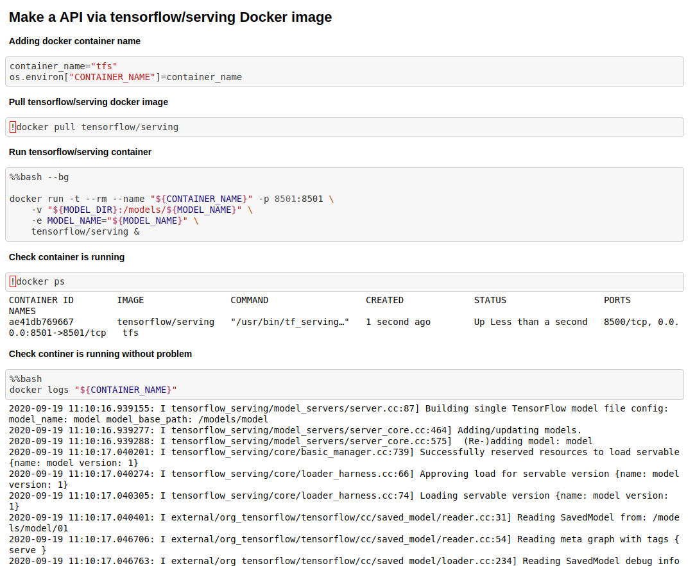
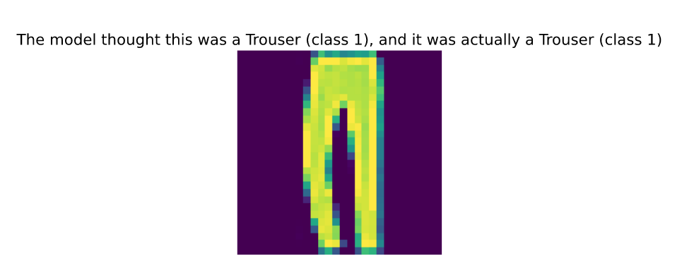

# Docker Cellar

This repo contains docker works,notes,examples.

## Example Descriptions

- **1-Basic_App** : Basic docker example, it is a image convert app. It converts a rgb image to a gray image.
  
  - **Folder** :

    - data/input : input image place
    - data/output : output image place
    - data/param : paramter file place

  - **Usage** :

    ``` bash
    - cd 1-Basic_App
    - docker build -t {example_image_name} .
    - docker run -it --rm -v "$(pwd)"/app:/app/ --name {example_container_name} {example_image_name}
    ```

- **2-API** : Simple Flask api for image process.

  - **Description**:
    - It convert a rgb image to a grey image like :
     
     
  
  - **Folder**:
  
    - app : example folder. It contains image folders and python scripts.

  - **Usage**:

    ```Bash
    - docker build -t {example_image_name} .
    - docker run --rm -it -v "$(pwd)"/app:/app --name test -p 5000:5000 {example_image_name} 
    - localhost:5000/inputs : show input image names
    - localhost:5000/convert : convert input images to grey images
    - localhost:5000/outputs : show grey image names
    ```

- **3-Nginx** (To do)

- **4-Tensorflow_Server** : Tensorflow/serving with Docker image example.

  - **Description**:
  
    - It is used fashion mnist data and created a REST API server via docker images.
    
  - **Usage**:
  
    - Just open notebook file and run cells:
    
      - Runnig Docker container
      
      
      
      - Results
      
      
      
      

- **5-Docker Swarm** (To do)
